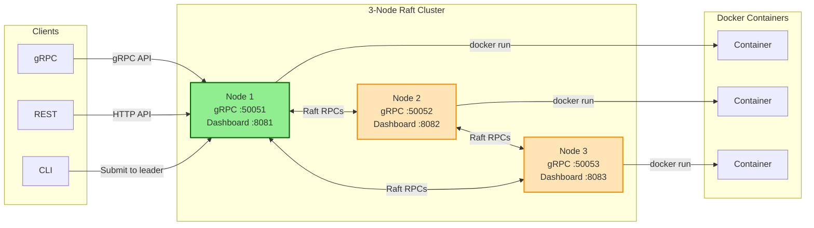
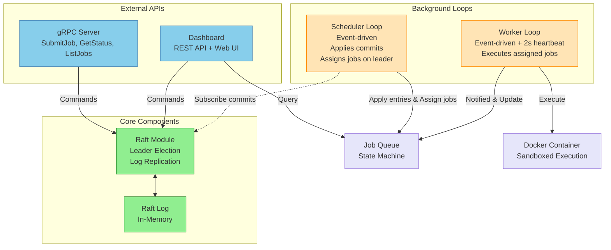
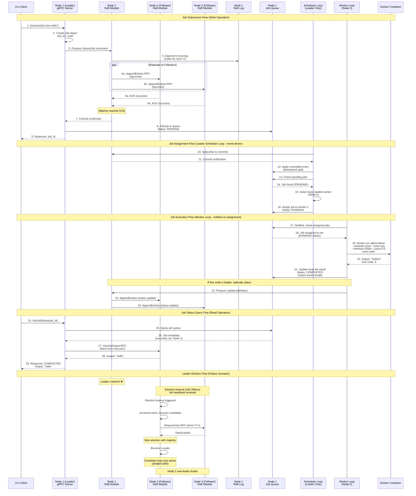

# nomad-lite

 [](https://codecov.io/gh/ngaddam369/nomad-lite)

A distributed job scheduler with custom Raft consensus, similar to Nomad or Kubernetes scheduler. Jobs are shell commands executed in isolated Docker containers across a cluster.

## Features

- **Custom Raft Consensus** - Leader election, log replication, and fault tolerance from scratch
- **Distributed Scheduling** - Jobs executed across cluster with automatic failover
- **Unified CLI** - Single binary for both server and client with automatic leader redirect
- **mTLS Security** - Mutual TLS for all gRPC communication
- **Docker Sandboxing** - Jobs run in isolated containers with restricted capabilities
- **Web Dashboard** - Real-time monitoring and job management
- **gRPC + REST APIs** - Type-safe client communication
- **Graceful Shutdown** - SIGTERM/SIGINT handling with drain period for in-flight work
- **Leader Draining & Transfer** - Voluntary leadership transfer and node draining for safe maintenance
- **Batch Replication** - Multiple job status updates batched into a single Raft log entry for reduced consensus overhead

## Requirements

| Dependency | Version | Installation |
|------------|---------|--------------|
| Rust | 1.56+ | `curl --proto '=https' --tlsv1.2 -sSf https://sh.rustup.rs \| sh` |
| protoc | 3.0+ | `apt install protobuf-compiler` / `brew install protobuf` |
| Docker | 20.0+ | `apt install docker.io` / `brew install --cask docker` |

## Architecture

### Cluster Overview



### Node Internal Architecture



**Key Points:**

- Every node runs all components (gRPC, Dashboard, Raft, Scheduler, Worker)
- Only the leader's Scheduler Loop assigns jobs; followers just apply committed entries
- Workers are notified immediately when jobs are assigned - no polling or RPC needed for job dispatch
- Job output is stored only on the executing node (fetched via `InternalService` RPC when queried)

## Data Flow



## Quick Start

```bash
# Build and install
cargo install --path .

# Run single node with dashboard
nomad-lite server --node-id 1 --port 50051 --dashboard-port 8080

# Open http://localhost:8080

# Submit a job (in another terminal)
nomad-lite job submit "echo hello"

# Check job status
nomad-lite job status <job-id>

# View cluster status
nomad-lite cluster status
```

## Running a Cluster

### Option 1: Docker Compose (Recommended)

The easiest way to run a 3-node cluster. Choose between production (mTLS) or development (no TLS) setup.

#### Production Setup (mTLS)

```bash
# Generate certificates (one-time setup)
./scripts/gen-test-certs.sh ./certs

# Start cluster
docker-compose up --build

# Stop cluster
docker-compose down
```

**Using the CLI with mTLS:**

```bash
# Check cluster status
nomad-lite cluster \
  --addr "https://127.0.0.1:50051" \
  --ca-cert ./certs/ca.crt \
  --cert ./certs/client.crt \
  --key ./certs/client.key \
  status

# Find the leader node from cluster status output, then submit to it
# Example: if Node 3 is leader, use port 50053
nomad-lite job \
  --addr "https://127.0.0.1:50053" \
  --ca-cert ./certs/ca.crt \
  --cert ./certs/client.crt \
  --key ./certs/client.key \
  submit "echo hello from mTLS"

# Get job status
nomad-lite job \
  --addr "https://127.0.0.1:50051" \
  --ca-cert ./certs/ca.crt \
  --cert ./certs/client.crt \
  --key ./certs/client.key \
  status <job-id>

# List all jobs
nomad-lite job \
  --addr "https://127.0.0.1:50051" \
  --ca-cert ./certs/ca.crt \
  --cert ./certs/client.crt \
  --key ./certs/client.key \
  list
```

#### Development Setup (No TLS)

```bash
# Start cluster
docker-compose -f docker-compose.dev.yml up --build

# Stop cluster
docker-compose -f docker-compose.dev.yml down
```

**Using the CLI without TLS:**

```bash
# Check cluster status
nomad-lite cluster --addr "http://127.0.0.1:50051" status

# Find the leader node from cluster status output, then submit to it
# Example: if Node 1 is leader, use port 50051
nomad-lite job --addr "http://127.0.0.1:50051" submit "echo hello"

# Get job status
nomad-lite job --addr "http://127.0.0.1:50051" status <job-id>

# List all jobs
nomad-lite job --addr "http://127.0.0.1:50051" list
```

**Cluster Endpoints:**

| Node | gRPC | Dashboard |
|------|------|-----------|
| 1 | `localhost:50051` | `localhost:8081` |
| 2 | `localhost:50052` | `localhost:8082` |
| 3 | `localhost:50053` | `localhost:8083` |

> **Note:** Auto-redirect doesn't work with Docker Compose because nodes report internal addresses (e.g., `node1:50051`) that aren't accessible from the host. Always check which node is leader using `cluster status` and connect directly to it for job submissions.

### Option 2: Local Multi-Node

Run nodes directly without Docker:

```bash
# Terminal 1
nomad-lite server --node-id 1 --port 50051 --dashboard-port 8081 \
  --peers "2:127.0.0.1:50052,3:127.0.0.1:50053"

# Terminal 2
nomad-lite server --node-id 2 --port 50052 --dashboard-port 8082 \
  --peers "1:127.0.0.1:50051,3:127.0.0.1:50053"

# Terminal 3
nomad-lite server --node-id 3 --port 50053 --dashboard-port 8083 \
  --peers "1:127.0.0.1:50051,2:127.0.0.1:50052"
```

**With mTLS:**

```bash
# Generate certificates first
./scripts/gen-test-certs.sh ./certs

# Add TLS flags to each node
--tls --ca-cert ./certs/ca.crt --cert ./certs/node1.crt --key ./certs/node1.key
```

## CLI Reference

The `nomad-lite` binary provides both server and client functionality.

```
nomad-lite
├── server                        # Start a server node
├── job                           # Job management
│   ├── submit <COMMAND>         # Submit a new job
│   ├── status <JOB_ID>          # Get job status
│   └── list                     # List all jobs
├── cluster                       # Cluster management
│   ├── status                   # Get cluster info
│   ├── transfer-leader          # Transfer leadership to another node
│   └── drain                    # Drain node for maintenance
└── log                           # Raft log inspection
    └── list                     # View committed log entries
```

### Server Options

| Flag | Default | Description |
|------|---------|-------------|
| `--node-id` | 1 | Unique node identifier |
| `--port` | 50051 | gRPC server port |
| `--dashboard-port` | - | Web dashboard port (optional) |
| `--peers` | "" | Peer addresses: `"id:host:port,..."` |
| `--image` | alpine:latest | Docker image for jobs |
| `--tls` | false | Enable mTLS |
| `--ca-cert` | - | CA certificate path |
| `--cert` | - | Node certificate path |
| `--key` | - | Node private key path |
| `--allow-insecure` | false | Run without TLS if certs fail |

### Client Options

| Flag | Default | Description |
|------|---------|-------------|
| `-a, --addr` | `http://127.0.0.1:50051` | Server address |
| `-o, --output` | `table` | Output format: `table` or `json` |
| `--ca-cert` | - | CA certificate for TLS |
| `--cert` | - | Client certificate for mTLS |
| `--key` | - | Client private key for mTLS |

### Command Examples

**Submit a job:**

```bash
nomad-lite job submit "echo hello"
# Job submitted successfully!
# Job ID: ef319e40-c888-490d-8349-e9c05f78cf5a
```

**Get job status:**

```bash
nomad-lite job status ef319e40-c888-490d-8349-e9c05f78cf5a
# Job ID:          ef319e40-c888-490d-8349-e9c05f78cf5a
# Status:          COMPLETED
# Exit Code:       0
# Assigned Worker: 1
# Executed By:     1
# Output:
#   hello
```

**List all jobs:**

```bash
nomad-lite job list
# JOB ID                                 STATUS       WORKER   COMMAND
# ------------------------------------------------------------------------------
# ef319e40-c888-490d-8349-e9c05f78cf5a   COMPLETED    1        echo hello
#
# Showing 1 of 1 jobs
```

**List jobs with pagination:**

```bash
nomad-lite job list --page-size 50 --all  # Fetch all pages
nomad-lite job list --stream              # Use streaming API
```

**Get cluster status:**

```bash
nomad-lite cluster status
# Cluster Status
# ========================================
# Term:   5
# Leader: Node 1
#
# Nodes:
# ID       ADDRESS                   STATUS
# ---------------------------------------------
# 1        0.0.0.0:50051             [+] alive
# 2        127.0.0.1:50052           [+] alive
# 3        127.0.0.1:50053           [+] alive
```

**Transfer leadership:**

```bash
# Transfer to a specific node
nomad-lite cluster -a http://127.0.0.1:50051 transfer-leader --to 2
# Leadership transferred successfully!
# New leader: Node 2

# Auto-select best candidate
nomad-lite cluster -a http://127.0.0.1:50051 transfer-leader
# Leadership transferred successfully!
# New leader: Node 3
```

**Drain a node for maintenance:**

```bash
# Drain the node: stops accepting jobs, waits for running jobs, transfers leadership
nomad-lite cluster -a http://127.0.0.1:50051 drain
# Draining node...
# Node drained successfully.
# Node drained successfully

# Verify leadership moved
nomad-lite cluster -a http://127.0.0.1:50052 status
```

**View Raft log entries:**

```bash
nomad-lite log list
# Raft Log Entries
# ================================================================================
# Commit Index: 6  |  Last Log Index: 6
#
# INDEX  TERM   COMMITTED  TYPE                 DETAILS
# --------------------------------------------------------------------------------
# 1      1      yes        Noop
# 2      1      yes        SubmitJob            job_id=bd764021-..., cmd=echo job1
# 3      1      yes        SubmitJob            job_id=1cce681f-..., cmd=echo job2
# 4      1      yes        SubmitJob            job_id=26694755-..., cmd=echo job3
# 5      1      yes        BatchUpdateJobStatus 3 updates
# 6      1      yes        UpdateJobStatus      job_id=17cc39b2-..., status=Completed
#
# Showing 6 entries
```

**View log entries with pagination:**

```bash
nomad-lite log list --start-index 1 --limit 50  # Start from index 1, max 50 entries
nomad-lite log list --start-index 10            # Start from index 10
```

**JSON output:**

```bash
nomad-lite job -o json list
nomad-lite cluster -o json status
nomad-lite log -o json list
```

### Automatic Leader Redirect

For local clusters (non-Docker), the CLI automatically redirects to the leader if you connect to a follower:

```bash
# Connect to follower node (port 50052), CLI auto-redirects to leader
nomad-lite job -a http://127.0.0.1:50052 submit "echo hello"
# Redirecting to leader at 127.0.0.1:50051...
# Job submitted successfully!
```

### REST API (Dashboard)

**Get cluster status:**

```bash
curl http://localhost:8081/api/cluster
# Response:
# {
#   "node_id": 1,
#   "role": "leader",
#   "current_term": 5,
#   "leader_id": 1,
#   "commit_index": 3,
#   "last_applied": 3,
#   "log_length": 3
# }
```

**Submit a job:**

```bash
curl -X POST http://localhost:8081/api/jobs \
  -H "Content-Type: application/json" \
  -d '{"command": "echo hello"}'
# Response:
# {
#   "job_id": "ef319e40-c888-490d-8349-e9c05f78cf5a",
#   "status": "pending"
# }
```

**List all jobs:**

```bash
curl http://localhost:8081/api/jobs
# Response:
# [
#   {
#     "id": "ef319e40-c888-490d-8349-e9c05f78cf5a",
#     "command": "echo hello",
#     "status": "completed",
#     "executed_by": 1,
#     "output": "hello\n",
#     "error": null,
#     "created_at": "2026-01-28T12:45:41.231558433+00:00",
#     "completed_at": "2026-01-28T12:45:41.678341558+00:00"
#   }
# ]
```

### gRPC API

**SchedulerService** (client-facing):

| Method | Description | Leader Only |
|--------|-------------|-------------|
| `SubmitJob(command)` | Submit a job | Yes |
| `GetJobStatus(job_id)` | Get job status | No |
| `ListJobs()` | List jobs (paginated) | No |
| `StreamJobs()` | Stream jobs | No |
| `GetClusterStatus()` | Cluster info | Forwarded to leader |
| `GetRaftLogEntries()` | View Raft log entries | Forwarded to leader |
| `TransferLeadership(target)` | Transfer leadership | Yes |
| `DrainNode()` | Drain node for maintenance | No |

**InternalService** (node-to-node, not client-facing):

| Method | Description |
|--------|-------------|
| `GetJobOutput(job_id)` | Fetch job output from the node that executed it |

## Security

### mTLS

All gRPC communication (node-to-node, client-to-node) can be secured with mutual TLS:

- Both parties authenticate via certificates signed by cluster CA
- All traffic encrypted with TLS 1.2+
- Generate certs: `./scripts/gen-test-certs.sh ./certs`

### Docker Sandboxing

Jobs run in isolated containers with:

| Restriction | Setting |
|-------------|---------|
| Network | `--network=none` |
| Capabilities | `--cap-drop=ALL` |
| Filesystem | `--read-only` |
| Privileges | `--security-opt=no-new-privileges` |
| Memory | `--memory=256m` |
| CPU | `--cpus=0.5` |

## Raft Implementation

### Timing

- **Election timeout:** 150-300ms (randomized)
- **Heartbeat interval:** 50ms

### Log Replication

1. Client sends command to leader
2. Leader appends to log and replicates via `AppendEntries`
3. Majority acknowledgment → committed
4. Applied to state machine

### Safety Guarantees

- Election safety: One leader per term
- Leader append-only: Never overwrites log
- Log matching: Same index/term = identical
- Leader completeness: Committed entries persist

### Cluster Sizing

| Nodes | Majority | Fault Tolerance |
|-------|----------|-----------------|
| 3 | 2 | 1 failure |
| 5 | 3 | 2 failures |
| 7 | 4 | 3 failures |

Use odd numbers—even numbers add overhead without improving fault tolerance.

## Testing

```bash
cargo test                # Run all tests
cargo test --lib          # Unit tests only
cargo test --test <name>  # Specific test suite
```

| Suite | Description |
|-------|-------------|
| `lib` (unit) | Config, Raft state machine, RPC serialization |
| `scheduler_tests` | Job queue, worker assignment, heartbeats |
| `raft_rpc_tests` | AppendEntries, RequestVote, term handling |
| `integration_tests` | Multi-node election, replication, consistency |
| `failover_tests` | Leader crash, re-election, quorum loss |
| `partition_tests` | Network partitions, split-brain prevention, healing |
| `chaos_tests` | Rapid leader churn, network flapping, cascading failures, full isolation recovery |
| `tls_tests` | mTLS certificate loading, encrypted cluster communication |
| `executor_tests` | Docker sandbox command execution |
| `internal_service_tests` | Internal node-to-node API, job output fetching |
| `dashboard_tests` | REST API endpoints |
| `leadership_transfer_tests` | Voluntary leadership transfer, auto-select, non-leader rejection |
| `drain_tests` | Node draining, job rejection during drain, leadership handoff |

