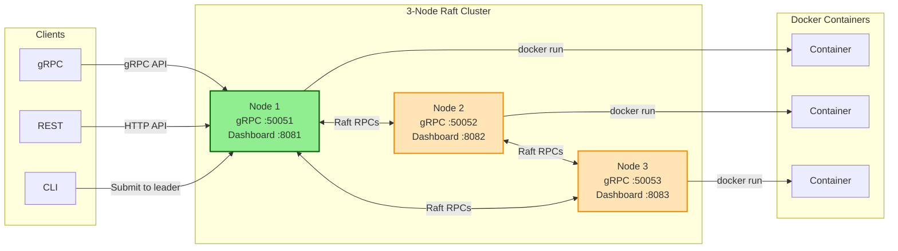
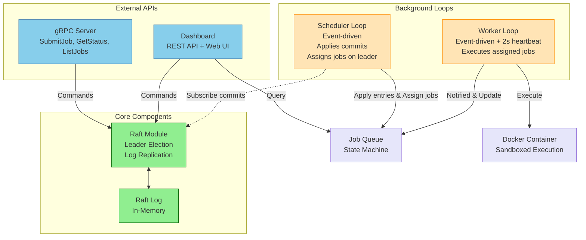
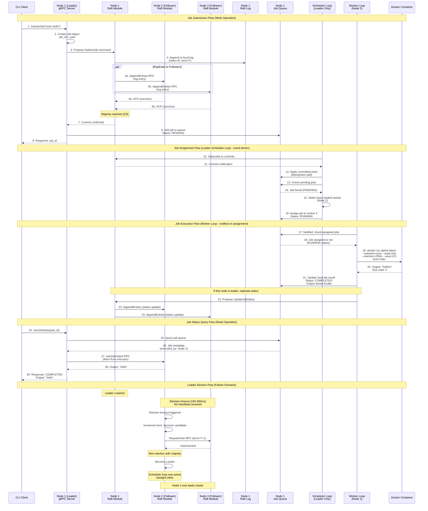

# Architecture

## Cluster Overview

## Node Internal Architecture

**Key Points:**

- Every node runs all components (gRPC, Dashboard, Raft, Scheduler, Worker)
- Only the leader's Scheduler Loop assigns jobs; followers just apply committed entries
- Workers are notified immediately when jobs are assigned - no polling or RPC needed for job dispatch
- Job output is stored only on the executing node (fetched via `InternalService` RPC when queried)

## Data Flow

